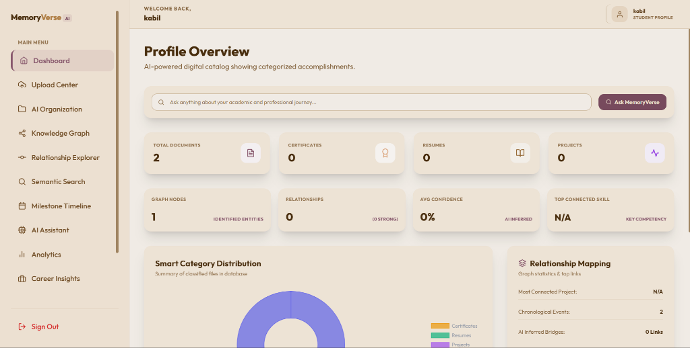
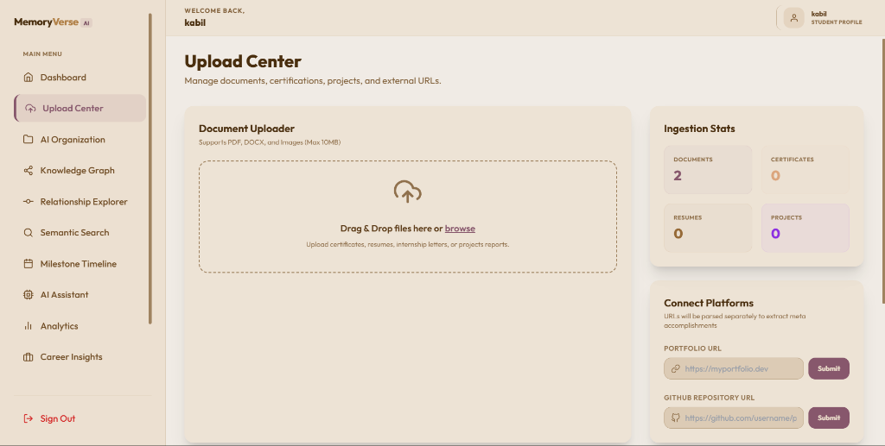
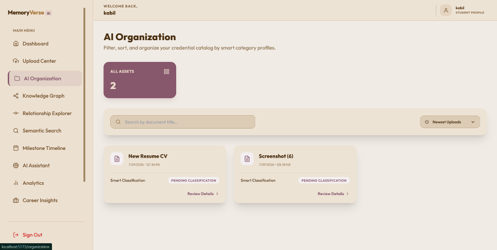

# MemoryVerse AI

MemoryVerse AI is a complete, full-stack Digital Identity System that intelligently stores, analyzes, categorizes, connects, and retrieves your academic and professional accomplishments. It builds an organic semantic knowledge graph of your skills, certifications, reports, and experiences.

---

## 📸 Screenshots

### 🔑 Authentication Portal


### 📊 Main Dashboard Overview


### 📥 Upload Center


### 📂 AI Smart Organization


---

## 🛠️ Tech Stack

- **Frontend**: React (Vite) + Tailwind CSS + Framer Motion + Vis.js (Network Graph) + Chart.js + Axios + React Router
- **Backend**: Spring Boot + Java 17 + Spring Data JPA + Spring Security + JWT Authentication + Java Mail Sender + MySQL
- **AI Service**: Python + FastAPI

---

## 🚀 Local Setup

### 1. Database
Create the database in MySQL:
```sql
SOURCE database/schema.sql;
```

### 2. AI Service
```bash
cd ai-service
pip install -r requirements.txt
uvicorn app.main:app --reload --port 8000
```

### 3. Backend API
Configure database & mail credentials in `backend/src/main/resources/application.properties`, then run:
```bash
cd backend
mvn spring-boot:run
```

### 4. Frontend Application
```bash
cd frontend
npm install
npm run dev
```
Open your browser at `http://localhost:5173`.
