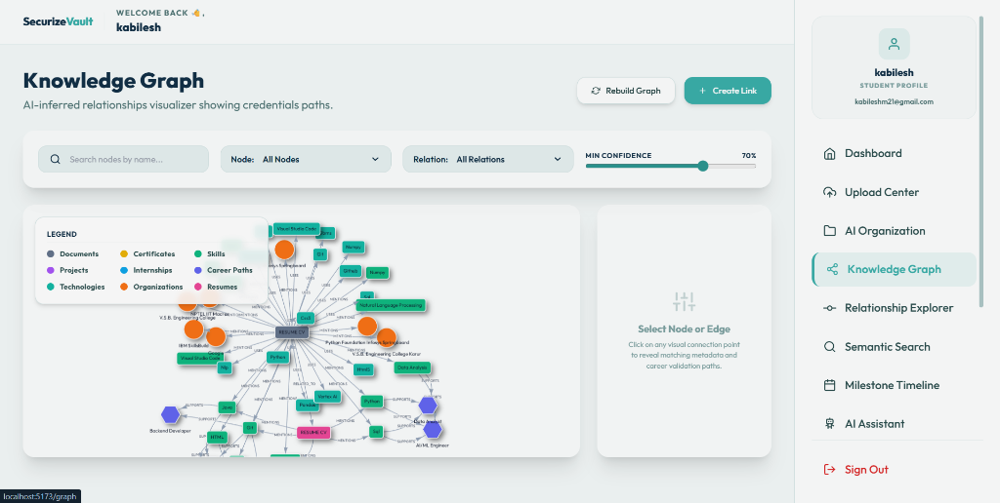
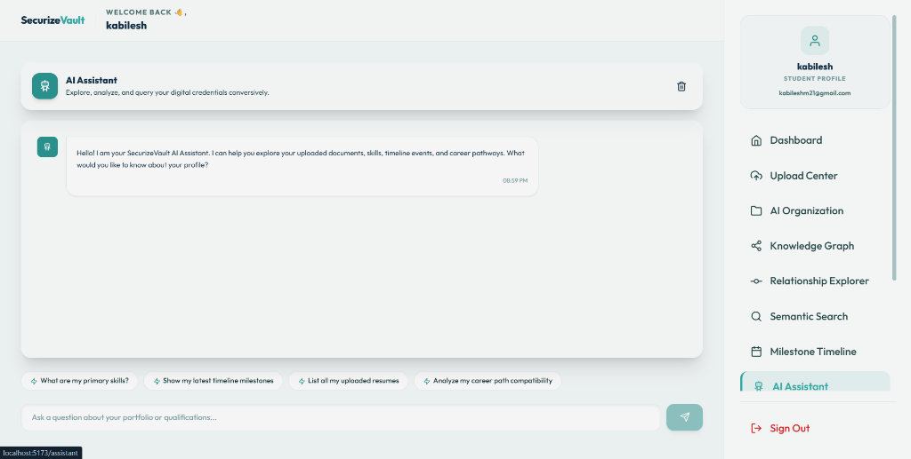

# 🔐 SecurizeVault

**SecurizeVault** is a complete, full-stack **AI-powered Digital Identity & Credential Management System** that intelligently stores, analyzes, categorizes, connects, and retrieves your academic and professional accomplishments. It builds an organic semantic knowledge graph of your skills, certifications, reports, and experiences — giving you a smart, searchable portfolio.

---

# Live link - https://securize-vault.vercel.app/

---

##  Key Features

| Module | Description |
|---|---|
| 🔑 **Authentication** | Secure login/register with JWT, forgot password with styled HTML email, and CAPTCHA-protected credential management |
| 📊 **Dashboard** | Profile overview with document stats, graph nodes, relationship counts, career path recommendations |
| 📥 **Upload Center** | Drag & drop document uploader (PDF, DOCX, Images) with OCR extraction and AI categorization |
| 📂 **AI Organization** | AI-powered smart document categorization with confidence scores and category correction |
| 🕸️ **Knowledge Graph** | Interactive force-directed graph visualization of skills, certifications, technologies, and career paths |
| 🔗 **Relationship Explorer** | Tabular view of all entity relationships with confidence filtering and source indicators |
| 🔍 **Semantic Search** | Natural language search across your entire portfolio with voice input support |
| 📅 **Milestone Timeline** | Chronological timeline of your academic and professional achievements |
| 🤖 **AI Assistant** | Conversational chatbot to explore your portfolio, skills, career compatibility, and documents |
| 🛡️ **Career Insights** | AI-matched career path recommendations based on extracted skills and competencies |
| 👤 **User Profile** | Editable profile with account details, vault security status, and session information |
| ⚙️ **Settings** | Change password with arithmetic CAPTCHA verification, account preferences |

---

## 📸 Screenshots

### 🔑 Authentication Portal


### 📊 Dashboard Overview


### 📥 Upload Center


### 🕸️ Knowledge Graph


### 🤖 AI Assistant


---

## 🛠️ Tech Stack

### Frontend
- **React 18** (Vite) — Fast HMR development server
- **Tailwind CSS** — Utility-first styling with custom theme
- **Framer Motion** — Smooth page transitions and animations
- **Vis.js Network** — Interactive knowledge graph rendering
- **Chart.js** — Data visualization and analytics
- **React Router v6** — Client-side routing
- **Axios** — HTTP client with JWT interceptors
- **React Icons** — Feather Icons + Tabler Icons

### Backend
- **Spring Boot 3.2** — Java 17 REST API framework
- **Spring Security** — JWT-based stateless authentication
- **Spring Data JPA** — ORM with Hibernate and MySQL
- **Java Mail Sender** — Styled HTML email templates (password reset)
- **Lombok** — Boilerplate reduction with annotations

### AI Service
- **Python 3** + **FastAPI** — High-performance async API
- **Google Gemini API** — LLM-powered categorization, entity extraction, and chat
- **PyPDF / python-docx** — Document text extraction
- **Multimodal OCR** — Image-to-text via Gemini vision

## 📁 Project Structure

```
SecurizeVault/
├── frontend/              # React + Vite frontend
│   ├── src/
│   │   ├── assets/        # Logo and static assets
│   │   ├── components/    # Navbar, Sidebar, MainLayout
│   │   ├── context/       # AuthContext, ThemeContext
│   │   ├── pages/         # All application pages
│   │   ├── routes/        # AppRoutes configuration
│   │   └── services/      # API service layer
│   └── index.html
├── backend/               # Spring Boot backend
│   └── src/main/java/com/memoryverse/
│       ├── controller/    # REST controllers
│       ├── dto/           # Request/Response DTOs
│       ├── entity/        # JPA entities
│       ├── exception/     # Global exception handler
│       ├── repository/    # Data access layer
│       ├── security/      # JWT + Spring Security config
│       └── service/       # Business logic
├── ai-service/            # Python FastAPI AI microservice
│   └── app/
│       ├── categorization/  # Document categorization
│       ├── routes/          # Ingestion & OCR endpoints
│       ├── smart_retrieval/ # Semantic search & vector store
│       └── utils/           # Gemini API utilities
├── database/              # SQL schema files
└── docs/images/           # Screenshots for README
```

---

## 👨‍💻 Author

**Kabilesh M**
- GitHub: [@kabilesh21](https://github.com/kabilesh21)
- Email: kabileshclg0678@gmail.com

---

## 📝 License

This project is for educational and portfolio purposes.
